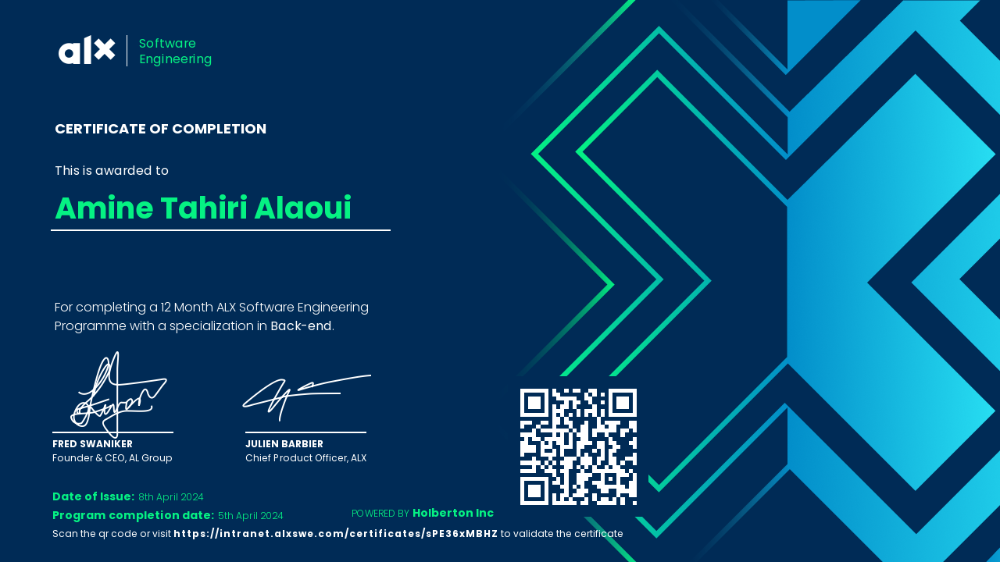

### Hello dear programmer 👋

My name is ✨ **Amine Tahiri Alaoui** ✨  
I am an indie developper, who get's very excited when seeing a _black_ and _white_ terminal 😁 
I try to improve myself everyday, and learn things the hard way

##### Projects that I'm actively working on right now:

- A new cooking app idea 🥞
- An attractive 2D pixel-art game 👾

##### Favorite tech that I use 💻:

- [Alacritty](https://github.com/alacritty/alacritty)
- [Neovim](https://github.com/neovim/neovim)
- [Tmux](https://github.com/tmux/tmux)
- [Zsh](https://zsh.sourceforge.io/)
- [oh-my-zsh](https://github.com/ohmyzsh/ohmyzsh)

##### My ALX Africa software engineering certificate:

**Huge shoutout to the amazing students and staff at Cohort-13 ❤️, you have been so helpful and never deny helping anyone, even it times of the final exams 🙏**

##### My Final Exams projects of each semester in ALX:

- [SimpleShell (sh shell clone in C using syscalls)](https://github.com/Blxee/simple_shell)
- [AirBnB Website Clone](https://github.com/Blxee/AirBnB_clone_v4)
- [MemberMaster (Full-Stack Web-App)](https://github.com/Blxee/member-master)
